Wprowadzenie do ggplot2 -- funkcja qplot
==================================


Materiały zawierają wprowadzenie do pakietu ggplot2, skupiają się na funkcji qplot, która jest podstawową funkcją do tworzenia wizualizacji. 

Pakiet **ggplot2** został stworzony przez dr Hadleya Wickhama, który jest również twórcą takich pakietów jak **reshape**, **reshape2**, **plyr**, **dplyr** oraz ułatwiających tworzenie własnych pakietów **devtools** oraz **testthat**.

Dr Hadley Wickham jest również odpowiedzialny za tworzenie **Rstudio** oraz współpracuje przy tworzeniu wielu pakietów (np. **shiny**). Dodatkowo zasiada w *R--foundation* (**R Core Team**) -- organizacji, która zajmuje się tworzeniem i usprawnianiem pakietu statystycznego R. Jest uznanym i często zapraszanym na konferencje twórcą i propagatorem pakietu *R*. Swój doktorat napisał np. wizualizacji danych.

Pakiet **ggplot2** jest rozbudowanym pakietem **ggplot** implementującym tzw. graficzną gramatykę (ang. *the Grammar of Graphics*), która jest opisana m.in. w <cytowanie>. Pakiet jest przeznaczony do wizualizacji danych statystycznych, do tworzenia wykresów, który rozbudowuje podstawowe możliwości wizualizacji danych w R. Pakiet ma specjalną składnię, która określa poszczególne elementy tworzonych wizualizacji. Korzystając z pakietu **ggplot2** użytkownik ma bardzo dużą swobodę w tworzeniu wizualizacji danych, a składnia jest prosta i intuicyjna.

The Grammar of Graphics
-----------------

Jest stworzonym przez Wilkinsona (2005) językiem opisu wizualizacji danych, który opiera się na szczegółowym opisie poszczególnych elementów przedstawiania danych statystycznych w przystępny sposób. Wickham stworzył implementację tego języka określając ją *layered grammar of graphics*.

Język można scharakteryzować następująco:
* określony jest zbiór danych (data),
* który chcemy przedstawić (zmapować, mapping) z odpowiednimi typami wizualizacji danych (aesthetic),
* za pomocą obiektów geometrycznych (geom), które zawierają m.in. linie, punkty.
* Dodatkowo chcemy przedstawić pewne miary statystyczne (stat), które mają opisywać prezentowany zbiór danych.
* Chcemy również aby każdy wykres miał określoną skalę (scale) oraz układ współrzędnych (coord).
* Interesuje nas również przedstawienie danych, które określają przynależność do poszczególnych grup (facet).

Opis składni funkcji qplot
-------------

Podstawową funkcją funkcją jest qplot, którą można rozwinąć jako *quick plot*. Jest to funkcja, która oferuje najważniejsze argumenty, które służą do tworzenia wykresu.


```r
library(ggplot2)
library(scales)
```


Składnia procedury jest następująca:


```r
  qplot(x, y = NULL, ..., data, facets = NULL,
    margins = FALSE, geom = "auto", stat = list(NULL),
    position = list(NULL), xlim = c(NA, NA),
    ylim = c(NA, NA), log = "", main = NULL,
    xlab = deparse(substitute(x)),
    ylab = deparse(substitute(y)), asp = NA)
```


Poszczególne argumenty odpowiadają za:
* x -- oś OX (odciętych)
* y -- oś OY (rzędnych)
* data -- zbiór danych
* facet -- wskazanie zmiennych dla których chcemy stworzyć oddzielne wizualizacje
* margins -- wskazuje czy chcemy wyświetlić marginesy na wykresie
* geom -- określa geometrię, którą chcemy zastosować
* stat -- wskazujemy (o ile chcemy) statystyki do przedstawienia na wykresie
* xlim, ylim -- określają zakres osi
* xlab, ylab -- określają etykiety osi
* main -- określa typ
* asp -- określa relację x/y 
* log -- wskazujemy transformację logarytmiczną osi ('x','y','xy')

Natomiast, jak w dużej części funkcji, pojawia się w funkcji symbol ..., który określa możliwość przekazywania arumentów do poszczególnych elementów wykresu (np. size, colour, fill).

Poniżej utworzymy pierwszy, prosty wykres rozrzutu, który przedstawia zależność między dochodem w 2005 a 2013 roku.


```r
qplot(x=adoch_os_m_05, ### wskazanie osi OX
      y=gdoch_m_osoba_ekw, ### wskazanie osi OY
      data=gosp, ### wskazanie zbioru danych 
      geom='point') ### geom = 'point' określa, że korzystamy z geometrii punktowej
```

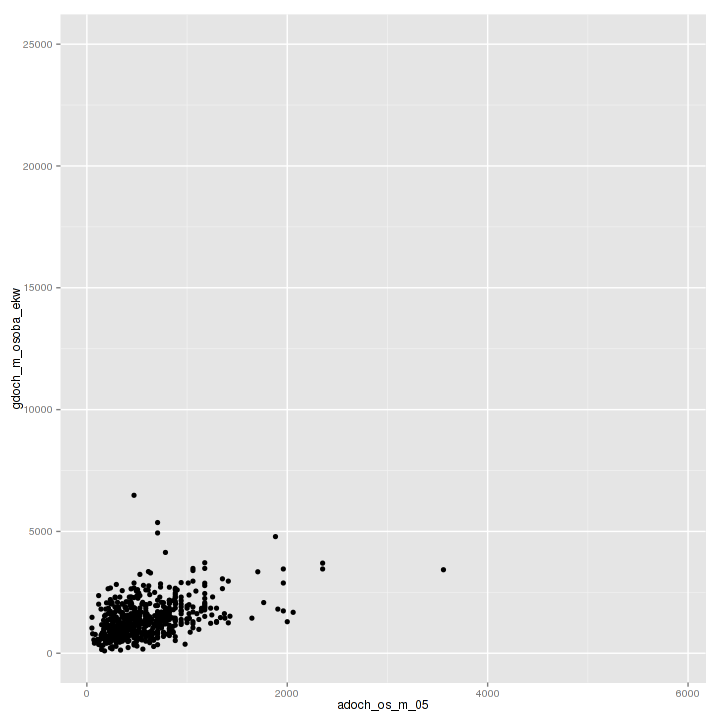 


Podobnie jak w podstawowym R, wynik procedury możemy zapisać do obiektu. Zapiszmy wykres do obiektu o nazwie p1 (jak plot one).


```r
p<-qplot(x=adoch_os_m_05, ### wskazanie osi OX
      y=gdoch_m_osoba_ekw, ### wskazanie osi OY
      data=gosp[,c('adoch_os_m_05','gdoch_m_osoba_ekw')], ### wskazanie zbioru danych 
      geom='point') ### geom = 'point' określa, że korzystamy z geometrii punktowej

### stwórzmy podsumowanie
summary(p)
```

```
data: adoch_os_m_05, gdoch_m_osoba_ekw [23804x2]
mapping:  x = adoch_os_m_05, y = gdoch_m_osoba_ekw
faceting: facet_null() 
-----------------------------------
geom_point:  
stat_identity:  
position_identity: (width = NULL, height = NULL)
```


Powyższy wydruk zawiera informacje, które wskazują poszczególne elementy wykresu:
* data -- wskazane są zmienne, które zostały wczytane oraz wymiar zbioru (wiersze x kolumny)
* mapping -- określają zmapowane zmienne. W tym przypadku zmapowaliśmy jedynie argumenty x oraz y
* faceting -- wskazuje zmienne, które użyliśmy do tworzenia oddzielnych wykresów (w tym przypadku nie mamy żadnych więc pojawia się opcja facet_null())

Poniżej kreski pojawiają się poszczególne informacje określające geometrię (geom_), statystyki (stat_) oraz pozycje (position_).

Chciałbym wskazać jeszcze jeden istotny element. Tworząc wykres warto wziąć pod uwagę ograniczenie zbioru danych do wykorzystywanych zmiennych. Jest to istotne w przypadku gdy korzystamy z dużego zbioru danych, zawierającego bardzo dużo zmiennych. Poniżej porównanie działania dwóch funkcji.


```r
#### wybranie tylko potrzebnych zmiennych
system.time(p<-qplot(x=adoch_os_m_05, ### wskazanie osi OX
      y=gdoch_m_osoba_ekw, ### wskazanie osi OY
      data=gosp[,c('adoch_os_m_05','gdoch_m_osoba_ekw')], ### wskazanie zbioru danych 
      geom='point') ### geom = 'point' określa, że korzystamy z geometrii punktowej
)
```

```
   user  system elapsed 
  0.004   0.000   0.007 
```

```r

#### wybranie wszystkch zmiennych 
system.time(p<-qplot(x=adoch_os_m_05, ### wskazanie osi OX
      y=gdoch_m_osoba_ekw, ### wskazanie osi OY
      data=gosp, ### wskazanie zbioru danych 
      geom='point') ### geom = 'point' określa, że korzystamy z geometrii punktowej
)
```

```
   user  system elapsed 
  1.584   0.000   1.585 
```


Wybranie tylko interesujących zmiennych przyśpieszyło działanie funkcji ponad 200 razy.

Mając to na uwadze, stwórzmy rozbudujmy wykres używając dodatkowych opcji:


```r
p<-qplot(x=adoch_os_m_05, ### wskazanie osi OX
      y=gdoch_m_osoba_ekw, ### wskazanie osi OY
      data=gosp[,c('adoch_os_m_05','gdoch_m_osoba_ekw')], ### wskazanie zbioru danych 
      geom='point',  ### geom = 'point' określa, że korzystamy z geometrii punktowej
      xlab='Dochód w 2005 roku', ### opis osi OX
      ylab='Dochód w 2013 roku', ### opis osi OY
      xlim=c(0,10000),  ### określenie zakresu osi OX
      ylim=c(0,10000)) ### określenie zakresu osi OY  
### wywołanie obiektu (możemy również tworzyć wizualizacje bez przypisywania do obiektów)
plot(p)
```

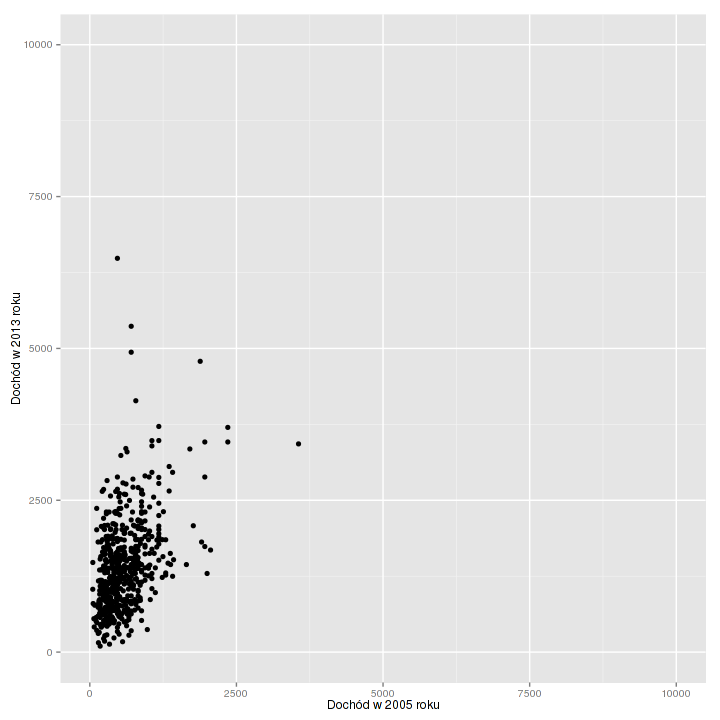 


Natomiast jeżeli chcemy wywołać ostatni stworzony wykres, możemy skorzystać z funkcji *last_plot()*.


```r
last_plot()
```

 


Możemy dodać do wykresu linię regresji, która wskaże nam kierunek zależności między tymi zmiennymi. Kolejne elementy określamy w argumencie *geom* podając wektor tekstowy. Dostępne geometrie, które są dostępne w ggplot są następujące:

* geom_abline -- Line specified by slope and intercept.
* geom_area -- Area plot.
* geom_bar -- Bars, rectangles with bases on x-axis
* geom_bin2d -- Add heatmap of 2d bin counts.
* geom_blank -- Blank, draws nothing.
* geom_boxplot -- Box and whiskers plot.
* geom_contour -- Display contours of a 3d surface in 2d.
* geom_crossbar -- Hollow bar with middle indicated by horizontal line.
* geom_density -- Display a smooth density estimate.
* geom_density2d -- Contours from a 2d density estimate.
* geom_dotplot -- Dot plot
* geom_errorbar -- Error bars.
* geom_errorbarh -- Horizontal error bars
* geom_freqpoly -- Frequency polygon.
* geom_hex -- Hexagon bining.
* geom_histogram -- Histogram
* geom_hline -- Horizontal line.
* geom_jitter -- Points, jittered to reduce overplotting.
* geom_line -- Connect observations, ordered by x value.
* geom_linerange -- An interval represented by a vertical line.
* geom_map -- Polygons from a reference map.
* geom_path -- Connect observations in original order
* geom_point -- Points, as for a scatterplot
* geom_pointrange -- An interval represented by a vertical line, with a point in the middle.
* geom_polygon -- Polygon, a filled path.
* geom_quantile -- Add quantile lines from a quantile regression.
* geom_raster -- High-performance rectangular tiling.
* geom_rect -- 2d rectangles.
* geom_ribbon -- Ribbons, y range with continuous x values.
* geom_rug -- Marginal rug plots.
* geom_segment -- Single line segments.
* geom_smooth -- Add a smoothed conditional mean.
* geom_step -- Connect observations by stairs.
* geom_text -- Textual annotations.
* geom_tile -- Tile plane with rectangles.
* geom_violin -- Violin plot.
* geom_vline -- Line, vertical.


```r
p<-qplot(x=adoch_os_m_05, ### wskazanie osi OX
      y=gdoch_m_osoba_ekw, ### wskazanie osi OY
      data=gosp[,c('adoch_os_m_05','gdoch_m_osoba_ekw')], ### wskazanie zbioru danych 
      geom=c('point','smooth'),  ### geom = 'point' określa, że korzystamy z geometrii punktowej
      xlab='Dochód w 2005 roku', ### opis osi OX
      ylab='Dochód w 2013 roku', ### opis osi OY
      xlim=c(0,10000),  ### określenie zakresu osi OX
      ylim=c(0,10000)) ### określenie zakresu osi OY  
### wywołanie obiektu (możemy również tworzyć wizualizacje bez przypisywania do obiektów)
plot(p)
```

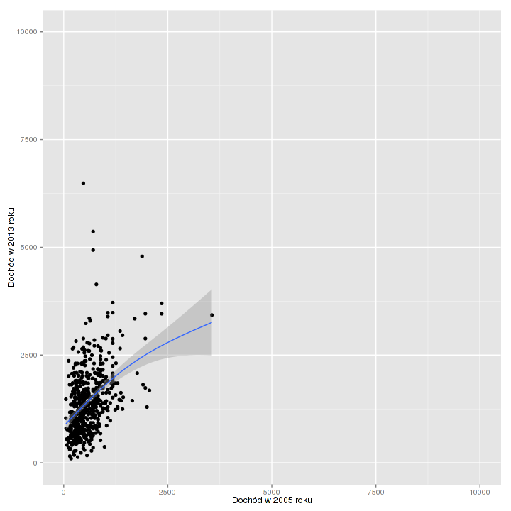 


**ggplot2** umożliwia tworzenie wykresów, które pozwalają na porównanie poszczególnych grup. Możemy wykorzystać do tego kilka opcji. Skorzystamy z najprostrzej tj. każdy punkt będzie miał odpowiedni kolor uzależniony od przynależności do klasy miejscowości. Chcemy sprawdzić czy występują różnice w zmianie dochodów w badanych gospodarstwach domowych.


```r
p<-qplot(x=adoch_os_m_05, ### wskazanie osi OX
      y=gdoch_m_osoba_ekw, ### wskazanie osi OY
      data=gosp[,c('adoch_os_m_05','gdoch_m_osoba_ekw','KLASA_MIEJSCOWOSCI')], ### wskazanie zbioru danych 
      geom=c('point','smooth'),  ### geom = 'point' określa, że korzystamy z geometrii punktowej
      colour=KLASA_MIEJSCOWOSCI,
      xlab='Dochód w 2005 roku', ### opis osi OX
      ylab='Dochód w 2013 roku', ### opis osi OY
      xlim=c(0,10000),  ### określenie zakresu osi OX
      ylim=c(0,10000)) ### określenie zakresu osi OY

### wywołanie obiektu (możemy również tworzyć wizualizacje bez przypisywania do obiektów)
plot(p)
```

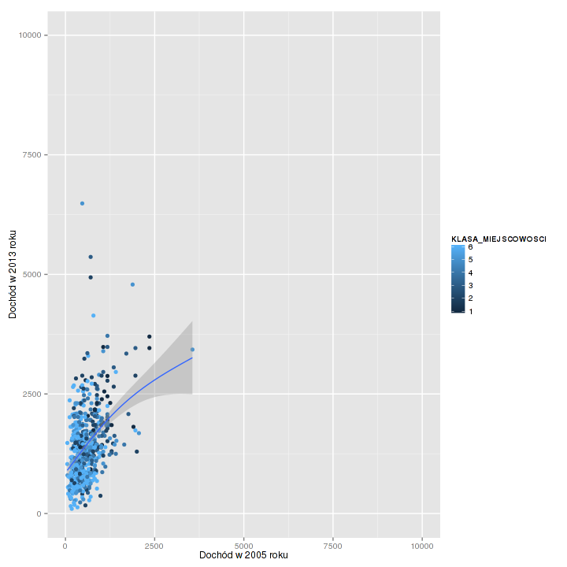 


Nie do końca otrzymaliśmy to co chceliśmy. Domyślnie zmienna określająca klasę miejscowości została potraktowana jako zmienna ciągła. Aby kolor dotyczył poszczególnych grup należy najpierw zmienić (bądź w ciele funkcji wpisać) typ zmiennej na factor.


```r
gosp$KLASA_MIEJSCOWOSCIf<-as.factor(gosp$KLASA_MIEJSCOWOSCI)
### lub równoważnie w ciele funkcji qplot (colour=as.factor(KLASA_MIEJSCOWOSCI))

p<-qplot(x=adoch_os_m_05, ### wskazanie osi OX
      y=gdoch_m_osoba_ekw, ### wskazanie osi OY
      data=gosp[,c('adoch_os_m_05','gdoch_m_osoba_ekw','KLASA_MIEJSCOWOSCIf')], ### wskazanie zbioru danych 
      geom=c('point','smooth'),  ### geom = 'point' określa, że korzystamy z geometrii punktowej
      colour=KLASA_MIEJSCOWOSCIf,
      xlab='Dochód w 2005 roku', ### opis osi OX
      ylab='Dochód w 2013 roku', ### opis osi OY
      xlim=c(0,10000),  ### określenie zakresu osi OX
      ylim=c(0,10000)) ### określenie zakresu osi OY
plot(p)
```

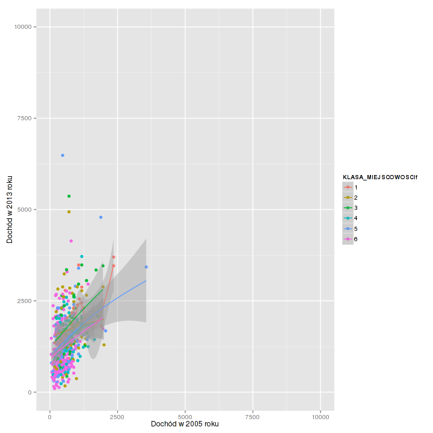 


Możemy zauważyć, że nachylenie krzywych jest podobne, a różni się poziomem rozpoczącia (wyrazem wolnym). Niestety w przypadku większej liczby punktów stosowanie kolorów może okazać się nieczytelne. W takim przypadku należy korzystać z opcji *facets*, która tworzy oddzielne wykresy dla poszczególnych wariantów zmiennej.


```r
p<-qplot(x=adoch_os_m_05, ### wskazanie osi OX
      y=gdoch_m_osoba_ekw, ### wskazanie osi OY
      data=gosp[,c('adoch_os_m_05','gdoch_m_osoba_ekw','KLASA_MIEJSCOWOSCIf')], ### wskazanie zbioru danych 
      geom=c('point','smooth'),  ### geom = 'point' określa, że korzystamy z geometrii punktowej
      facets=~KLASA_MIEJSCOWOSCIf, ### określenie zmiennej określającej wykresy
      xlab='Dochód w 2005 roku', ### opis osi OX
      ylab='Dochód w 2013 roku', ### opis osi OY
      xlim=c(0,10000),  ### określenie zakresu osi OX
      ylim=c(0,10000)) ### określenie zakresu osi OY
plot(p)
```

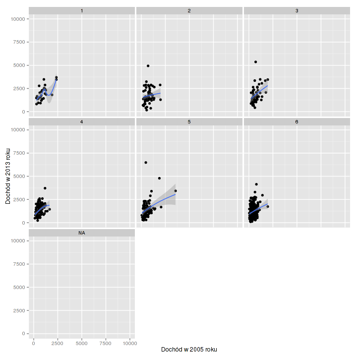 


Opcja ta ma specyficzną składnię:

* .~ zmienna  -- oznacza stworzenie zmiennej grupującej tworzacej panele kolumnowe
* zmienna~. -- oznacza stworzenie zmiennej grupującej tworzacej panele wierszowe
* ~zmienna -- oznacza stworzenie zmiennej grupującej tworzacej panele bez rozróżnienia na wierszcze czy kolumny.


```r
### .~ zmienna
p<-qplot(x=adoch_os_m_05, ### wskazanie osi OX
      y=gdoch_m_osoba_ekw, ### wskazanie osi OY
      data=gosp[,c('adoch_os_m_05','gdoch_m_osoba_ekw','KLASA_MIEJSCOWOSCIf')], ### wskazanie zbioru danych 
      geom=c('point','smooth'),  ### geom = 'point' określa, że korzystamy z geometrii punktowej
      facets=.~KLASA_MIEJSCOWOSCIf, ### określenie zmiennej określającej wykresy
      xlab='Dochód w 2005 roku', ### opis osi OX
      ylab='Dochód w 2013 roku', ### opis osi OY
      xlim=c(0,10000),  ### określenie zakresu osi OX
      ylim=c(0,10000)) ### określenie zakresu osi OY
plot(p)
```

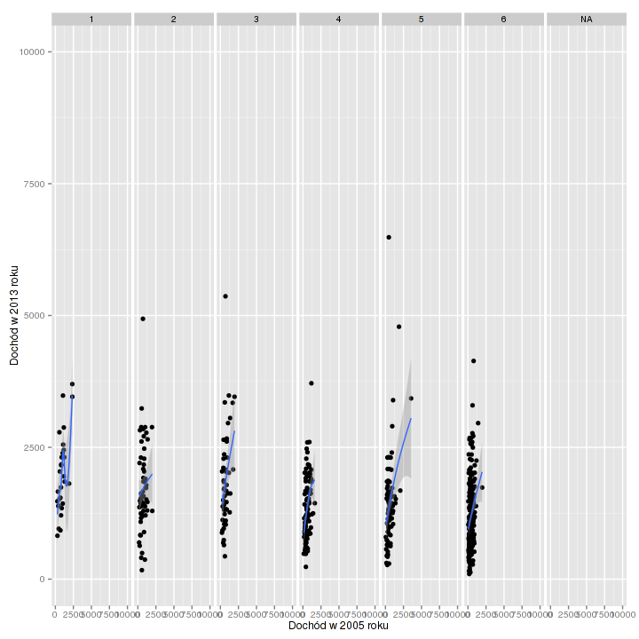 

```r

### zmienna~.
p<-qplot(x=adoch_os_m_05, ### wskazanie osi OX
      y=gdoch_m_osoba_ekw, ### wskazanie osi OY
      data=gosp[,c('adoch_os_m_05','gdoch_m_osoba_ekw','KLASA_MIEJSCOWOSCIf')], ### wskazanie zbioru danych 
      geom=c('point','smooth'),  ### geom = 'point' określa, że korzystamy z geometrii punktowej
      facets=KLASA_MIEJSCOWOSCIf~., ### określenie zmiennej określającej wykresy
      xlab='Dochód w 2005 roku', ### opis osi OX
      ylab='Dochód w 2013 roku', ### opis osi OY
      xlim=c(0,10000),  ### określenie zakresu osi OX
      ylim=c(0,10000)) ### określenie zakresu osi OY
plot(p)
```

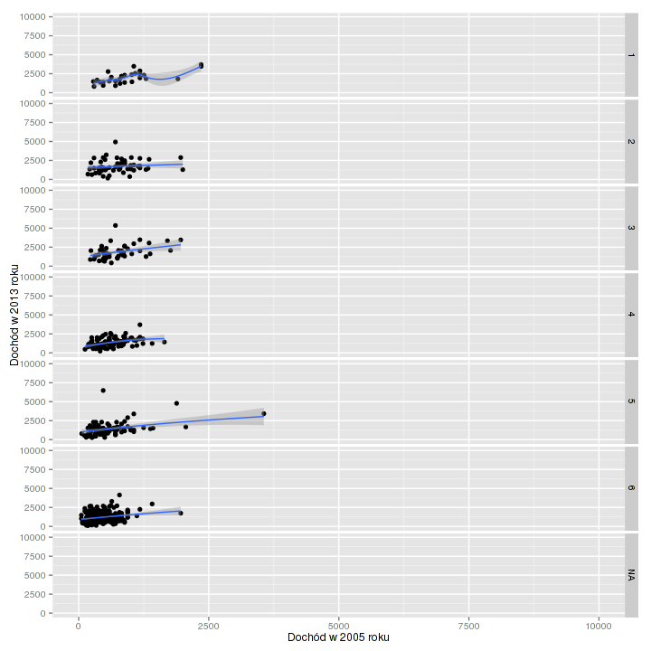 


Operator specjalny %+% oraz %+replace%
-------

Przypisywanie wykresów do obiektów ma bardzo dużą zaletę. Załóżmy, że stworzyliśmy wykres i chcemy go wykorzystać do tworzenia kolejnych w pętli. Możliwe jest wykonanie tego dzięki operatorim %+% oraz %+repace%.

**Operator %+% odpowiedzialny jest za zmianę zbioru danych**, i dodatkowo:

* uneval: replace current aesthetics
* layer: add new layer
* theme: update plot theme
* scale: replace current scale
* coord: override current coordinate system
* facet: override current coordinate faceting

**Operator %+replace% za zmianę poszczególnych elementów wykresu (wyglądu tematu, theme)**.

Załóżmy, że chcielibyśmy wykonać ten sam wykres, który znajduje się powyżej (z facets = ~KLASA_MIEJSCOWOSCI), jednak nie chcemy tworzyć lub przeklejać całego wykresu tylko zmienić jego element. W pierwszej kolejności musimy zmienić zbiór danych na których pracujemy na taki, który zawiera zmienną WOJEWÓDZTWO wg której będziemy go tworzyć.


```r
p<-qplot(x=adoch_os_m_05, ### wskazanie osi OX
      y=gdoch_m_osoba_ekw, ### wskazanie osi OY
      data=gosp[,c('adoch_os_m_05','gdoch_m_osoba_ekw','KLASA_MIEJSCOWOSCIf')], ### wskazanie zbioru danych 
      geom=c('point','smooth'),  ### geom = 'point' określa, że korzystamy z geometrii punktowej
      facets=~KLASA_MIEJSCOWOSCIf, ### określenie zmiennej określającej wykresy
      xlab='Dochód w 2005 roku', ### opis osi OX
      ylab='Dochód w 2013 roku', ### opis osi OY
      xlim=c(0,10000),  ### określenie zakresu osi OX
      ylim=c(0,10000)) ### określenie zakresu osi OY

summary(p)
```

```
data: adoch_os_m_05, gdoch_m_osoba_ekw, KLASA_MIEJSCOWOSCIf [23804x3]
mapping:  x = adoch_os_m_05, y = gdoch_m_osoba_ekw
scales:   x, xmin, xmax, xend, xintercept, y, ymin, ymax, yend, yintercept, ymin_final, ymax_final 
faceting: facet_wrap(KLASA_MIEJSCOWOSCIf) 
-----------------------------------
geom_point:  
stat_identity:  
position_identity: (width = NULL, height = NULL)

geom_smooth:  
stat_smooth:  
position_identity: (width = NULL, height = NULL)
```

```r

### dokonaliśmy teraz zmiany zbioru danych 
p<-p %+% gosp[,c('adoch_os_m_05','gdoch_m_osoba_ekw','KLASA_MIEJSCOWOSCIf','WOJEWODZTWO')]

summary(p)
```

```
data: adoch_os_m_05, gdoch_m_osoba_ekw, KLASA_MIEJSCOWOSCIf, WOJEWODZTWO [23804x4]
mapping:  x = adoch_os_m_05, y = gdoch_m_osoba_ekw
scales:   x, xmin, xmax, xend, xintercept, y, ymin, ymax, yend, yintercept, ymin_final, ymax_final 
faceting: facet_wrap(KLASA_MIEJSCOWOSCIf) 
-----------------------------------
geom_point:  
stat_identity:  
position_identity: (width = NULL, height = NULL)

geom_smooth:  
stat_smooth:  
position_identity: (width = NULL, height = NULL)
```


Używając operatora %+% zmieniliśmy 

Teraz możemy spróbować zamienić facets na zmienną określającą województwo. Musimy tego dokonać funkcją facet_wrap (na której będziemy się później skupiać).


```r
p<-p %+% facet_wrap(~WOJEWODZTWO)
summary(p)
```

```
data: adoch_os_m_05, gdoch_m_osoba_ekw, KLASA_MIEJSCOWOSCIf, WOJEWODZTWO [23804x4]
mapping:  x = adoch_os_m_05, y = gdoch_m_osoba_ekw
scales:   x, xmin, xmax, xend, xintercept, y, ymin, ymax, yend, yintercept, ymin_final, ymax_final 
faceting: facet_wrap(WOJEWODZTWO) 
-----------------------------------
geom_point:  
stat_identity:  
position_identity: (width = NULL, height = NULL)

geom_smooth:  
stat_smooth:  
position_identity: (width = NULL, height = NULL)
```


Jak widać pakiet ggplot2 jest potężnym narzędziem, które zdecydowanie ułatwia pracę przy tworzeniu szeregu wykresów.

Inne typy wykresów
-------------

Póki co zajęliśmy się jednym typem (geometrią) wizualizacji. Teraz czas na kolejne, które możemy przedstawić za pomocą funkcji qplot. Jako pierwszą zajmiemy się wiuzualizacją rozkładu zmiennej z wykorzystaniem histogramu. Będziemy chcieli sprawdzić jak prezentuje się rozkład dochodów ekwiwalentnych na osobę w 2013 roku.


```r
### rozkład dochodów 
p<-qplot(x=gdoch_m_osoba_ekw,
         data=gosp[,c('adoch_os_m_05','gdoch_m_osoba_ekw','KLASA_MIEJSCOWOSCIf','WOJEWODZTWO')],
         geom='histogram')
plot(p)
```

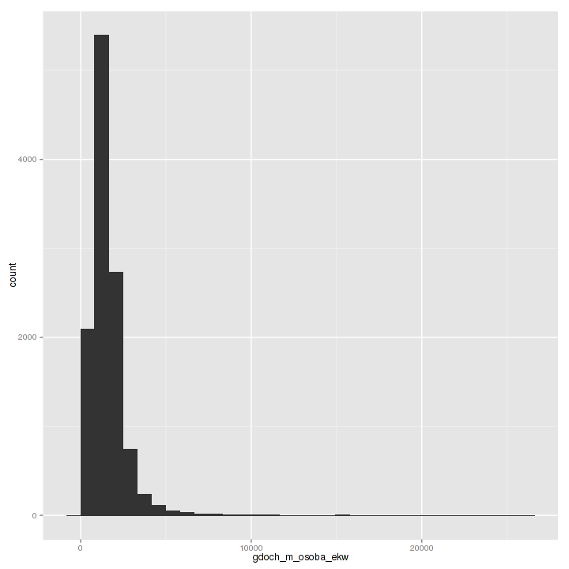 

```r

### dodamy teraz kolor wg klasy miejscowosci
p %+% aes(fill=KLASA_MIEJSCOWOSCIf)
```

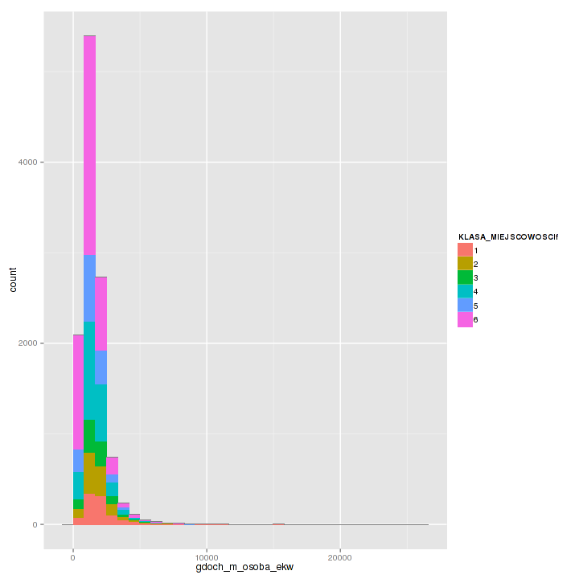 

```r

### niestety wykres nie jest czytelny, należy zmienić  wypełnienie na oddzielne wykresy

p %+% facet_wrap(~KLASA_MIEJSCOWOSCIf)
```

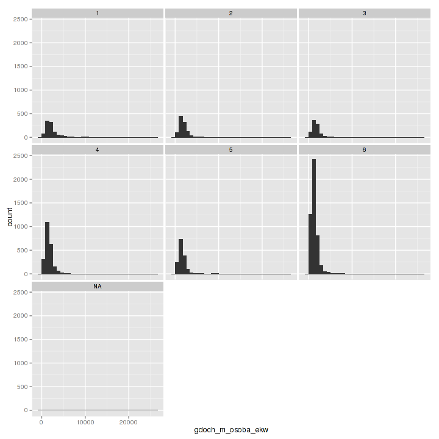 

```r

## a także prezentację w postaci gęstości prawdopodobieństwa, a nie częstości

p %+% facet_wrap(~KLASA_MIEJSCOWOSCIf) %+% aes(y=..density..) 
```

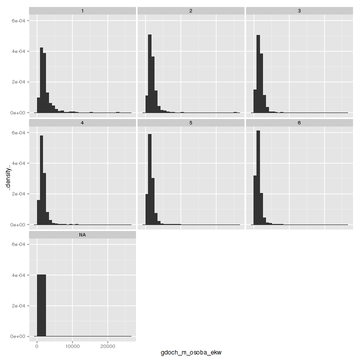 


W ten sposób możemy przejść do zmiany typu wykresu z histogramu na rozkład gęstości zmiennej (aby być precyzyjnym graficznego przedstawienia estymacji parametrów rozkładu metodą jądrową). Niestety operator %+% i musimy wprowadzić zmiany w obiekcie p na nowo go tworząc.


```r
p<-qplot(x=gdoch_m_osoba_ekw,
         data=gosp[,c('adoch_os_m_05','gdoch_m_osoba_ekw','KLASA_MIEJSCOWOSCIf','WOJEWODZTWO')],
         geom='density')
plot(p)
```

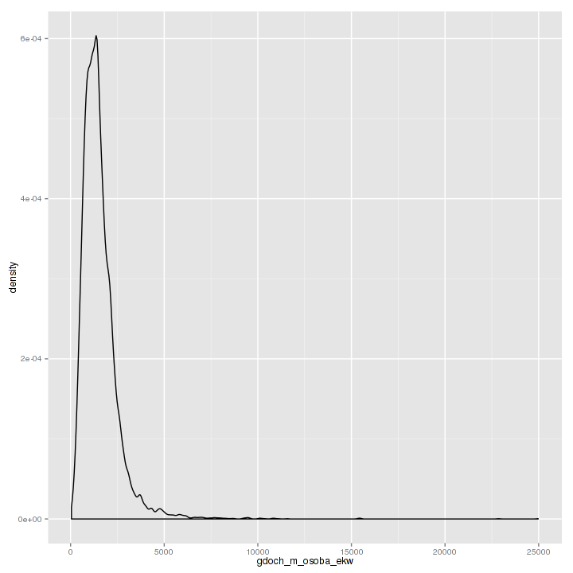 


Natomiast kolejne zmiany możemy wykonywać podobnie jak w przypadku poprzednich wykresów możemy zmieniać elementy wykresu operatorem %+%.


```r
p %+% aes(colour=KLASA_MIEJSCOWOSCIf)
```

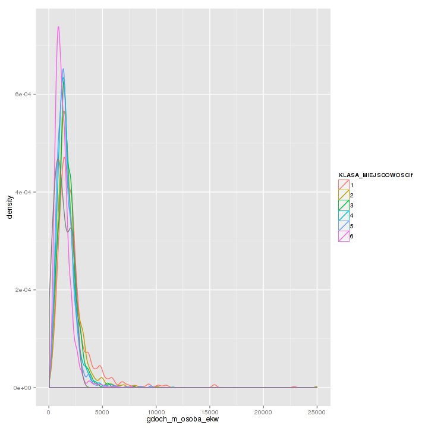 


Możemy również zmienić z koloru obramowania na wypełnienie oraz skalę logarytmiczną


```r
p %+% aes(fill=KLASA_MIEJSCOWOSCIf) %+% scale_x_log10()
```

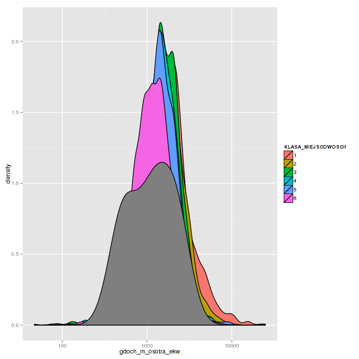 

```r

### przypisanie do obiektu
p<-p %+% aes(fill=KLASA_MIEJSCOWOSCIf) %+% scale_x_log10()

### ustalenie przezroczystności (działa gdy zainstalowany jest pakiet scales)
p %+% aes(alpha=0.7) 
```

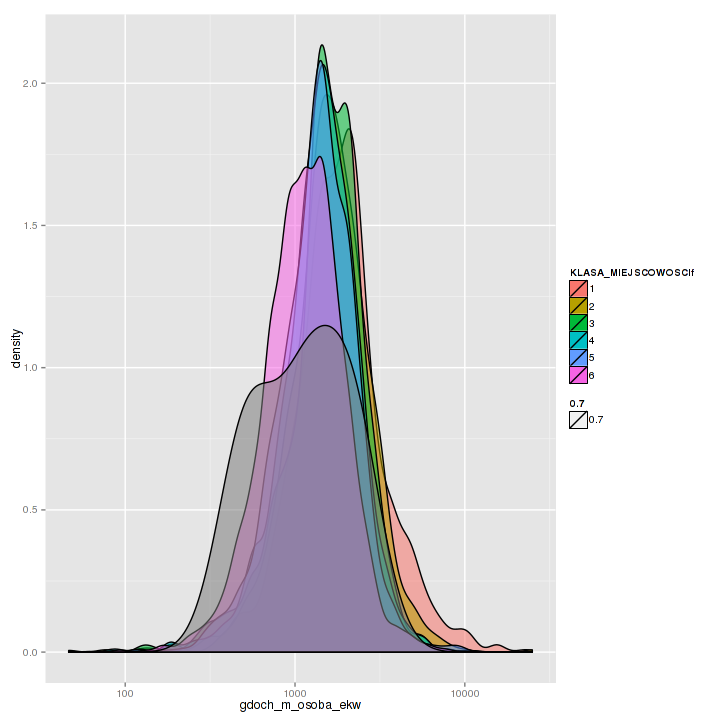 


