Zaawansowana obsługa pakietu ggplot2 -- funkcja ggplot
==================================


Wymagane pakiety!


```r
### wczytanie pakietów
library(ggthemes)
library(ggplot2)
library(scales)
library(hexbin)
library(GGally)
library(reshape2)
```


Na zajęciach zapoznamy się z pracą w pakiecie ggplot2. Do tej pory korzystaliśmy z funkcji *qplot*, która służy do tworzenia szybkich wykresów (jak sama nazwa mówi - quick plot). Funkcja ta ma jednak ograniczenia i polecana jest do szybkich podsumowań. Jeżeli chcemy poznać prawdziwe możliwości pakietu ggplot2 należy zapoznać się z funkcją *ggplot* oraz operatorem *+*, który służy do rozbudowywania poszczególnych elementów wykresu.

Zaczniemy od stworzenia tego samego wykresu z wykorzystaniem funkcji *qplot* oraz *ggplot*. 


```r
#### składnia qplot
p1<-qplot(x=adoch_os_m_05, ### wskazanie osi OX
      y=gdoch_m_osoba_ekw, ### wskazanie osi OY
      data=gosp[,c('adoch_os_m_05','gdoch_m_osoba_ekw')], ### wskazanie zbioru danych 
      geom='point') ### geom = 'point' określa, że korzystamy z geometrii punktowej
p1
```

 

```r

#### składnia ggplot
p2<-ggplot(data=gosp[,c('adoch_os_m_05','gdoch_m_osoba_ekw')], ### wskazanie zbioru danych
           aes(x=adoch_os_m_05,y=gdoch_m_osoba_ekw)) + ### wskazanie elementów wykresu (mapowanie estetyki ang. mapping aesthetics)
  geom_point() ### wskazanie geometrii z której korzystamy
p2
```

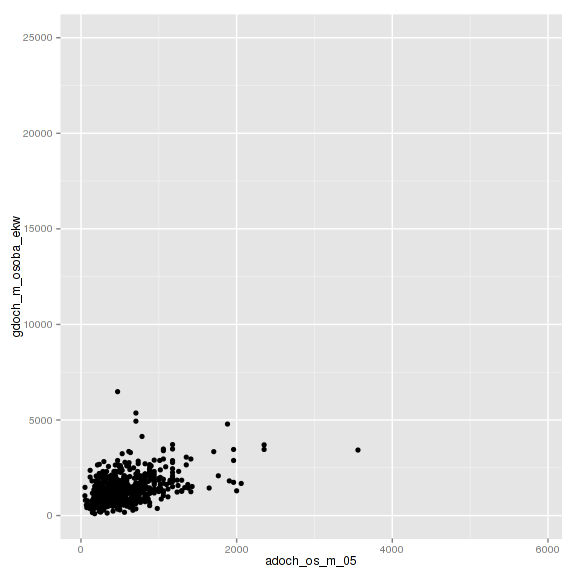 


W wyniku dostaniemy dokładnie ten sam wykres. Przyjrzyjmy się funkcji ggplot bliżej. Funkcja *ggplot*, posiada dwa główne argumenty:

* data - w którym podajemy zbiór danych 
* aes (lub aes_string) - w którym określamy poszczególne elementy wykresu (ang. *aesthetics*, pol. *estetyka*) 

Argument aes jest bardzo istotny ponieważ w nim określamy co i w jaki sposób będzie przedstawione na tworzonym wykresie. Podstawowymi argumentami, które możemy okreslić są:

* x - określamy oś OX
* y - określamy os OY
* group - określamy zmienną grupującą
* color (lub colour) - okreslamy zmienną, która będzie określała kolorowanie poszczególnych punktów (obwoluta)
* fill - okreslamy zmienną, która wypełni kolorem poszczególne elementy wykresu

Dodatkowo: 
* size - możemy określić zmienną, która będzie definiowała wielkość punktów (np. dochody mogą określać wielkość punktów)
* shape - możemy określić zmienną, która będzie definiowała kształt punktów

Spójrzmy jakie będą różnice w tworzeniu dwóch wykresów punktowych. W pierwszym określimy kolor jako zmienną grupującą, natomiast w drugim kształt jako zmienną grupującą.


```r
gosp$KLASA_MIEJSCOWOSCI<-as.factor(gosp$KLASA_MIEJSCOWOSCI) ## tworzenie factora - inaczej traktuje jako zmienną ciągłą

p2<-ggplot(data=gosp[,c('adoch_os_m_05',
                        'gdoch_m_osoba_ekw',
                        'KLASA_MIEJSCOWOSCI')],
           aes(x=adoch_os_m_05,
               y=gdoch_m_osoba_ekw,
               colour=KLASA_MIEJSCOWOSCI)) + ## określenie kolorów
  geom_point()

p3<-ggplot(data=gosp[,c('adoch_os_m_05',
                        'gdoch_m_osoba_ekw',
                        'KLASA_MIEJSCOWOSCI')],
           aes(x=adoch_os_m_05,
               y=gdoch_m_osoba_ekw,
               shape=KLASA_MIEJSCOWOSCI)) + ### określenie kształtów
  geom_point()

p2
```

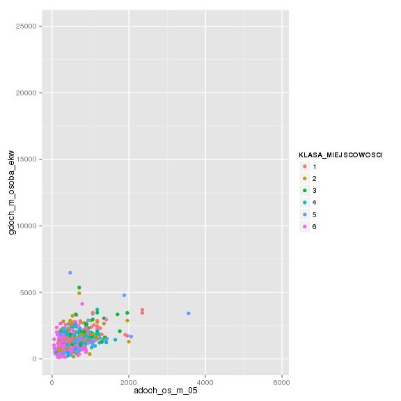 

```r
p3
```

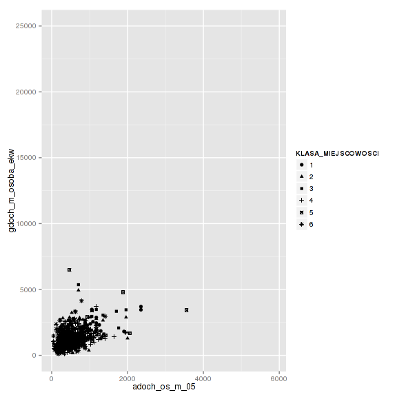 


Jak możemy zauważyć aes pozwala streować elementami wykresu. Możemy określić na raz wiele elementów wykresu. Należy mieć jednak na uwadze to, że może to wpłynąć w znacznym stopniu na czytelność grafiki.


```r
gosp$WOJEWODZTWO<-as.factor(gosp$WOJEWODZTWO) 
p<-ggplot(data=gosp[,c('adoch_os_m_05',
                        'gdoch_m_osoba_ekw',
                        'KLASA_MIEJSCOWOSCI',
                        'L.OSOB_2013',
                        'WOJEWODZTWO')],
           aes(x=adoch_os_m_05,
               y=gdoch_m_osoba_ekw,
               shape=KLASA_MIEJSCOWOSCI, ## kształty
               size=L.OSOB_2013,         ## wielkość punktu
               colour=WOJEWODZTWO)) +    ## kolor
  geom_point()
p
```

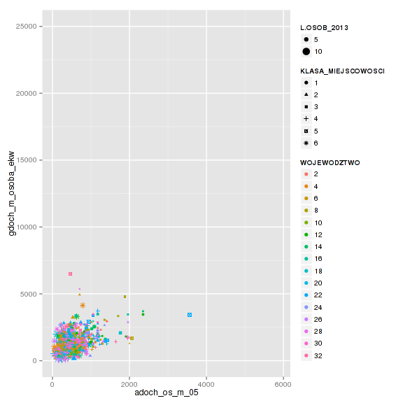 


Łączenie geometrii
-----------

Pakiet ggplot umożliwia bardzo łatwe tworzenie wykresów, które składają się z różnych geometrii - na przykład możemy połączyć punkty oraz nanieść regresję lub połączyć wykres gęstości i histogram.

Stwórzmy histogram i nanieśmy wykres gęstości. 


```r
### zapisanie do obiektu
p<-ggplot(data=gosp[,c('gdoch_m_osoba_ekw',
                       'KLASA_MIEJSCOWOSCI')],
          aes(x=gdoch_m_osoba_ekw))

### dodawanie kolejnych elementów
p + geom_histogram(aes(y=..density..),fill='white',colour='black') + 
  geom_density(colour='red')
```

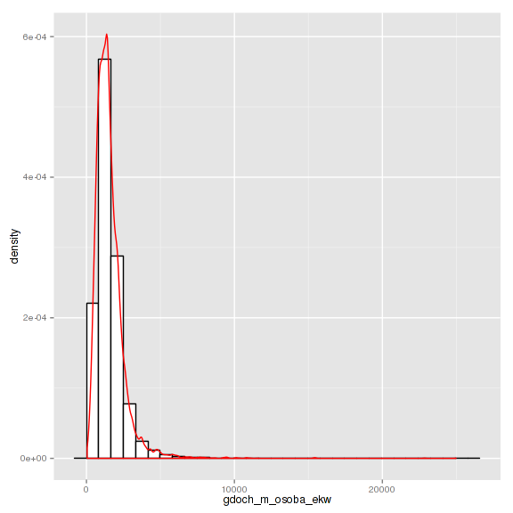 


Dla czytelności należałoby zmienić os OX na logarytmiczną. Warto zauważyć, że poszczególne elementy dodajemy po symbolu + a także, że możemy do obiektu przypisywać wynik tworzenia wykresu. W związku z tym wystarczy jedynie:


```r
### wykres który chcemy żeby był stały (podstawa)

p<- p + geom_histogram(aes(y=..density..),
                       fill='white',
                       colour='black') + 
  geom_density(colour='red')

p + scale_x_log10()
```

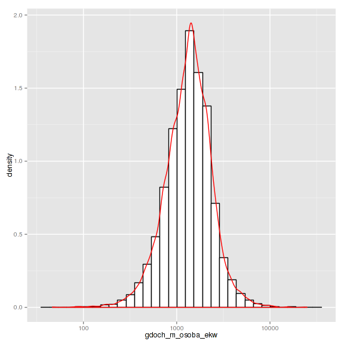 


W ten sposób poznaliśmy rodzinę funkcji, które określają skale. Mogą one kontrolować następujące elementy:

* osie (x i y, przykład dla x):
  * scale_x_continuous - kontrola osi x (zmienna ciągła).
  * scale_x_date - kontrola osi x (zmienna typu data)
  * scale_x_datetime - kontrola osi x (zmienna typu data czas)
  * scale_x_discrete - kontrola osi x (zmienna dyskretna)
  * scale_x_log10	- kontrola osi x (zamiana na log10)
  * scale_x_reverse	- kontrola osi x (odwrócenie wartości)
  * scale_x_sqrt	- kontrola osi x (pierwiastek)
* wypełnienia:
  * scale_fill_brewer  Sequential, diverging and qualitative colour scales from colorbrewer.org
  * scale_fill_continuous	Smooth gradient between two colours
  * scale_fill_discrete	Qualitative colour scale with evenly spaced hues.
  * scale_fill_gradient	Smooth gradient between two colours
  * scale_fill_gradient2	Diverging colour gradient
  * scale_fill_gradientn	Smooth colour gradient between n colours
  * scale_fill_grey	Sequential grey colour scale.
  * scale_fill_hue	Qualitative colour scale with evenly spaced hues.
  * scale_fill_identity	Use values without scaling.
  * scale_fill_manual	Create your own discrete scale.
* kolorów:
  * scale_color_brewer  Sequential, diverging and qualitative colour   * scales from colorbrewer.org
  * scale_color_continuous	Smooth gradient between two colours
  * scale_color_discrete	Qualitative colour scale with evenly spaced hues.
  * scale_color_gradient	Smooth gradient between two colours
  * scale_color_gradient2	Diverging colour gradient
  * scale_color_gradientn	Smooth colour gradient between n colours
  * scale_color_grey	Sequential grey colour scale.
  * scale_color_hue	Qualitative colour scale with evenly spaced hues.
  * scale_color_identity	Use values without scaling.
  * scale_color_manual	Create your own discrete scale.
  * scale_colour_brewer	Sequential, diverging and qualitative colour scales from colorbrewer.org
  * scale_colour_continuous	Smooth gradient between two colours
  * scale_colour_discrete	Qualitative colour scale with evenly spaced hues.
  * scale_colour_gradient	Smooth gradient between two colours
  * scale_colour_gradient2	Diverging colour gradient
  * scale_colour_gradientn	Smooth colour gradient between n colours
  * scale_colour_grey	Sequential grey colour scale.
  * scale_colour_hue	Qualitative colour scale with evenly spaced hues.
  * scale_colour_identity	Use values without scaling.
  * scale_colour_manual	Create your own discrete scale.
* wielkości punktów
  * scale_size  Size scale.
  * scale_size_area	Scale area instead of radius, for size.
  * scale_size_continuous	Size scale.
  * scale_size_discrete	Size scale.
  * scale_size_identity  Use values without scaling.
  * scale_size_manual	Create your own discrete scale.
* kształty
  * scale_shape  Scale for shapes, aka glyphs.
  * scale_shape_continuous	Scale for shapes, aka glyphs.
  * scale_shape_discrete	Scale for shapes, aka glyphs.
  * scale_shape_identity	Use values without scaling.
  * scale_shape_manual	Create your own discrete scale.

I wiele wiele innych. 

Sprawdzmy jakie zmiany spowoduje użycie poszczególnych funkcji. Załóżmy, że chcemy przedstawić za pomocą pudełkowego dochód ekwiwalenty wg klasy miejscowości oraz odpowiedzi na pytanie GF6 ('F6. Czy Pana(i) gospodarstwo domowe posiada jakieś oszczędności?').


```r
### stwórzmy factory
gosp$GF6<-as.factor(gosp$GF6)

### zmienna zawiera braki danych - możemy podejrzeć czym się charakeryzują osoby, które nie udzieliły odpowiedzi
table(gosp$GF6,useNA='ifany')
```

```

    1     2  <NA> 
 4737  7553 11514 
```

```r

p<-ggplot(data=gosp[,c('KLASA_MIEJSCOWOSCI','WAGA_GD_2013',
                       'GF6','gdoch_m_osoba_ekw')],
          aes(x=KLASA_MIEJSCOWOSCI,
                        fill=GF6,
                        y=gdoch_m_osoba_ekw),
          weight=WAGA_GD_2013) +
  geom_boxplot()
p
```

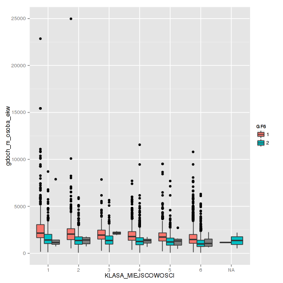 


Wykres nie do końca spełnia nasze wymagania. Chcemy nadać etykiety dla osi oraz opisać zmienna grupującą. Należy do tego wykorzystać scales.


```r
p <- p + scale_fill_brewer(name='F6. Czy Pana(i)\n gospodarstwo \n domowe posiada\njakieś oszczędności?',
                      palette='Reds',
                      breaks=c(1,2),
                      labels=c('Tak','Nie')) +
  scale_x_discrete(breaks=c(1,2,3,4,5,6),
                   labels=c('500k+','200-500k','100-200k',
                            '20-100k','pon.20k','wieś')) +
  xlab('Klasa miejscowości') +
  ylab('Miesięczny dochód rozporządzalny na jednostkę ewkiwalentną') +
  ggtitle('Zależność między dochodem, klasą miejscowości, 
          a posiadaniem oszczędności')
p
```

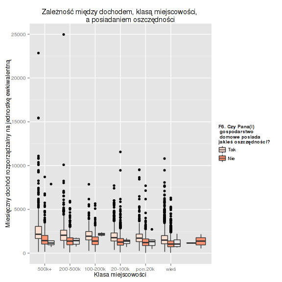 


Jak można zauważyć, wykres bardzo się rozbudowuje i kod może zawierać się w wielu liniach. Dzięki dodatkowym funkcjom bardzo łatwo możemy zmieniać poszczególne elementy. Oprócz funkcji rozpoczynających się od scale mamy również funkcję theme, która odpowiada za wygląd wykresu (wielkość czcionek, kolory osi itp.). Pełną dokumentację można znaleźć [tutaj](http://docs.ggplot2.org/current/theme.html). Wykorzystamy kilka dostępnych tematów.


```r
p + theme_bw()
```

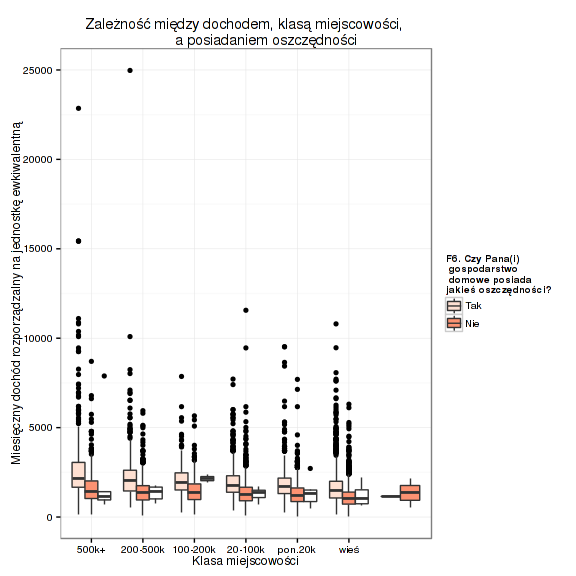 

```r
p + theme_grey()
```

 

```r
p + theme_minimal()
```

 


Dodatkowo w pakiecie ggthemes


```r
p + theme_excel() ## excel :)
```

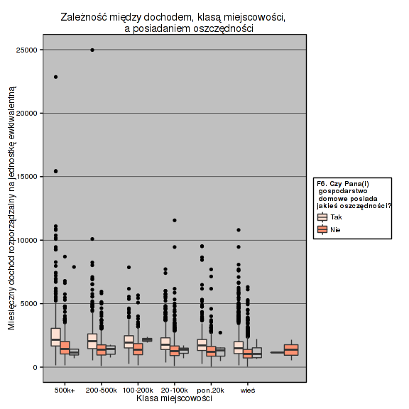 

```r
p + theme_economist() #
```

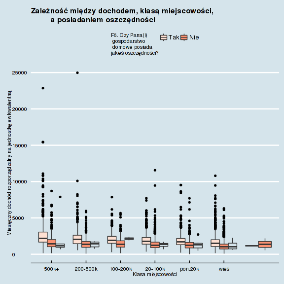 

```r
p + theme_gdocs() ## dokumenty google
```

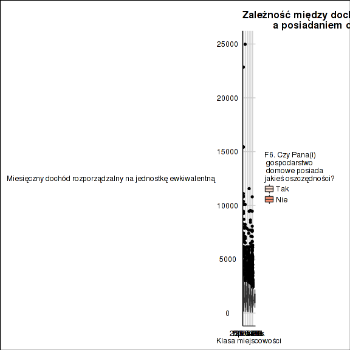 

```r
p + theme_solarized()
```

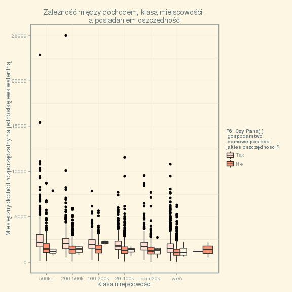 


Wizualizacja danych tabelarycznych
--------

Załóżmy, że chcielibyśmy przedstawić na wykresie słupkowym odpowiedź na pytanie o posiadanie poszczególnych urządzeń. Są to pytania, które rozpoczynają się od GF18A_01 do GF18A_19. W pierwszej kolejności musimy zagregować dane aby móc je nanieść na wykres. Wykorzystamy w tym celu funkcję *sapply* oraz *table*.


```r
### szukam pozycji kolumn
start<-which(names(gosp)=='GF18A_01')
end<-which(names(gosp)=='GF18A_19')

### agreguję dane
gf18<-sapply(gosp[,start:end],table)
class(gf18)
```

```
[1] "matrix"
```

```r
gf18<-as.data.frame(gf18)
gf18$ID<-rownames(gf18)
```


Następnie aby doprowadzić do tzw. postaci długiej (ang. *long*). Możemy do tego wykorzystać funkcję **reshape2::melt**.


```r
gf18l<-melt(gf18,id.vars='ID')
### dodaję kolumnę z wartościami procentowymi
gf18l<-ddply(gf18l,.(variable), mutate, valuep=value/sum(value))
head(gf18l)
```

```
  ID variable value  valuep
1  1 GF18A_01 11336 0.91842
2  2 GF18A_01  1007 0.08158
3  1 GF18A_02  2691 0.21843
4  2 GF18A_02  9629 0.78157
5  1 GF18A_03  7192 0.58339
6  2 GF18A_03  5136 0.41661
```


Na tak przygotowanym zbiorze możemy zastosować funkcję **ggplot**.
Poniższy kod tworzy wykres słupkowy


```r
p<-ggplot(data=gf18l, aes(x=variable,y=valuep,fill=ID)) +
  geom_bar(position='stack',stat='identity')
p
```

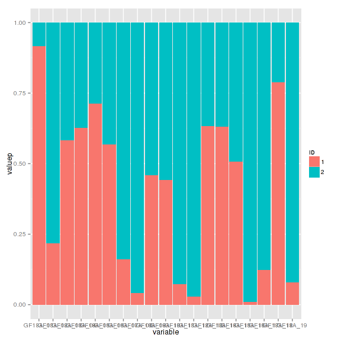 


Jest to wykres skumulowany, jeżeli chcemy obrócić wykres możemy wykorzystac funkcję *coord_flip()*, natomiast jeżeli interesuje nas odpowiednie ułożenie kolejności korzystamy z funkcji *reorder*.


```r
### obrót wykresu
p + coord_flip()
```

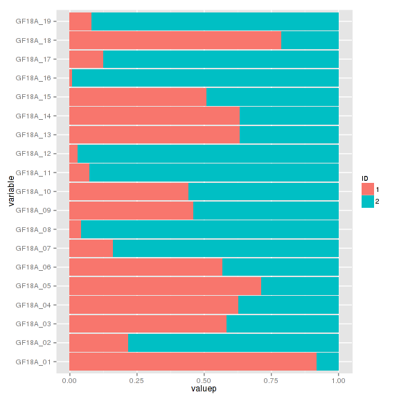 

```r

### sortujemy wg valuep i id
varorder<-gf18l[order(gf18l$ID,gf18l$valuep), ]
varorder<-varorder[varorder$ID==1,'variable']
gf18l$variable<-factor(as.character(gf18l$variable),
                       levels=varorder,
                       labels=varorder,
                       ordered=T)
### podmienimy zbiór danych na posortowany
p %+% gf18l + coord_flip() + 
  geom_bar(colour='black',position='stack',stat='identity') + 
  xlab('') + ylab('Procent odpowiedzi') +
  scale_fill_brewer(name='Odp', 
                    palette='BrBG',
                    breaks=c(1,2),
                    labels=c('Tak','Nie')) +
  scale_x_discrete(breaks=as.character(varorder),
                   labels=dictionary[match(as.character(varorder),
                                     dictionary$colName),'label']) +
  theme_bw() +
  scale_y_continuous(labels=percent) 
```

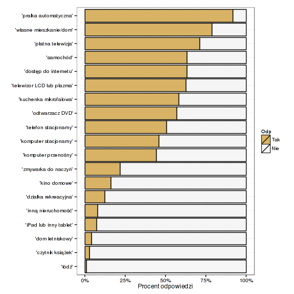 


